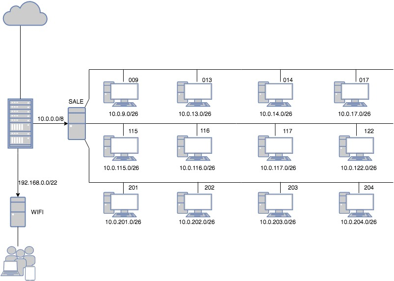

ZADANIE 12
--- 

* Wi-Fi ``192.168.0.0/22``

* LAN  np. ``10.0.9.0/26``
   * /26 = 62 hostów
  
  
#### Przydział adresów:
------
### Poziom 0
  * sala 009:
    *  ``10.0.9.0/26``
  * sala 013:
    *  ``10.0.13.0/26``
  * sala 014:
    *  ``10.0.14.0/26``
  * sala 017:
    *  ``10.0.17.0/26``
  Po 35 komputerów w każdej sali co daje nam 140 komputerów na pięrze 0.
    
### Poziom 1
  * sala 115:
    * ``10.0.115.0/26``
  * sala 116:
    * ``10.0.116.0/26``
  * sala 117:
    * ``10.0.117.0/26``
  * sala 122:
    * ``10.0.122.0/26``
  Po 35 komputerów w każdej sali co daje nam 140 komputerów na pięrze 1.    
    
### Poziom 2
  * sala 201:
    * ``10.0.201.0/26``
  * sala 202:
    * ``10.0.202.0/26``
  * sala 203:
    * ``10.0.203.0/26``
  * sala 204:
    * ``10.0.204.0/26``
  Po 35 komputerów w każdej sali co daje nam 140 komputerów na pięrze 2.
  
  3 x 140 komputerów  = 420 komputerów
  
  
  ### Diagram:
  ---
  
  
  
  
### IP Forwarding
---
``echo 1 >/proc/sys/net/ipv4/ip_forward``
 w ``/etc/sysctl.conf`` odkomenować linijke

### Routing
---
``ip route add default via {ip}`` 

### Masquerade
---
``iptables -t nat -A POSTROUTING -s {ip sieci} -o {interfejs} -j MASQUERADE``
  
### Karty sieciowe ip
---
``ip a add {ip} dev {interfejs}`` 

### MAIN
---
|KARTA   |adres ip          |
|------- |----------------- | 
|enp0s3  |NAT               |
|enp0s8  |10.0.0.1/8        |
|enp0s9  |192.168.0.1/22    |
|enp0s10:|188.156.220.162/27|

``ip route add default via 10.0.0.1 dev enp0s3``

``iptables -t nat -A POSTROUTING -s 10.0.0.0/8 -o enp0s3 -j MASQUERADE``

``iptables -t nat -A POSTROUTING -s 192.168.0.0/22 -o enp0s3 -j MASQUERADE``

### DHCP DLA WIFI: 

``apt-get install isc-dhcp-server

  systemctl start isc-dhcp-server``

### w:

``/etc/default/isc-dhcp-server

/etc/dhcp/dhcpd.conf``

### DODAJ:

subnet 192.168.0.0. netmask 255.255.252.0{

       option routers 192.168.0.1;
       
       range 192.168.0.2 192.168.3.254;
       
}

### LAN
---

|KARTA   |adres ip    |
|------- |------------| 
|enp0s3  |10.0.0.2/8  |
|enp0s8  |10.0.9.62/26|

+  plus karty sieciowe na komputery 

``ip route add default via 10.0.0.1 dev enp0s3``

### Komputer w sali 
---

|KARTA   |adres ip   |
|------- |---------- | 
|enp0s3  |10.0.9.1/26|

``ip route add default via 10.0.9.62 dev enp0s3``

w ``/etc/network/interfaces`` nałożyć statyczne ip

